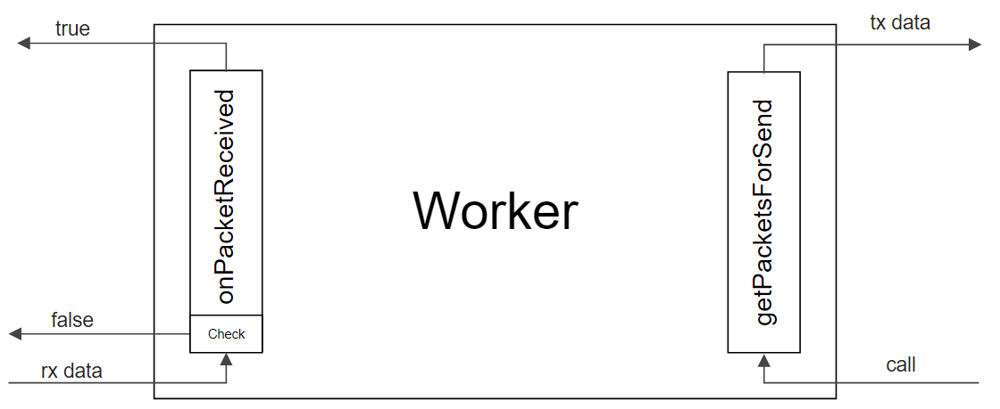
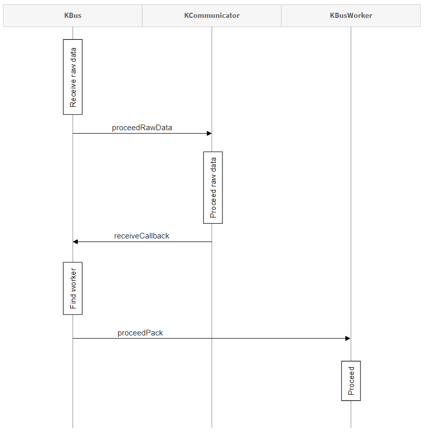
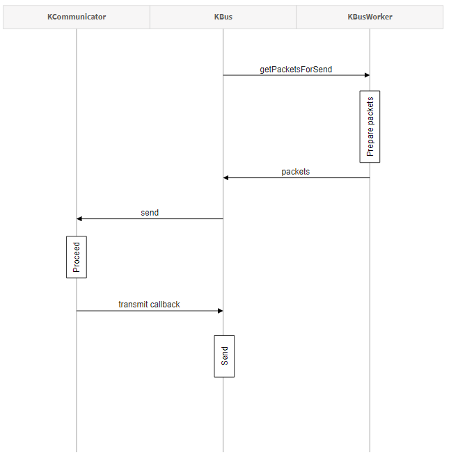
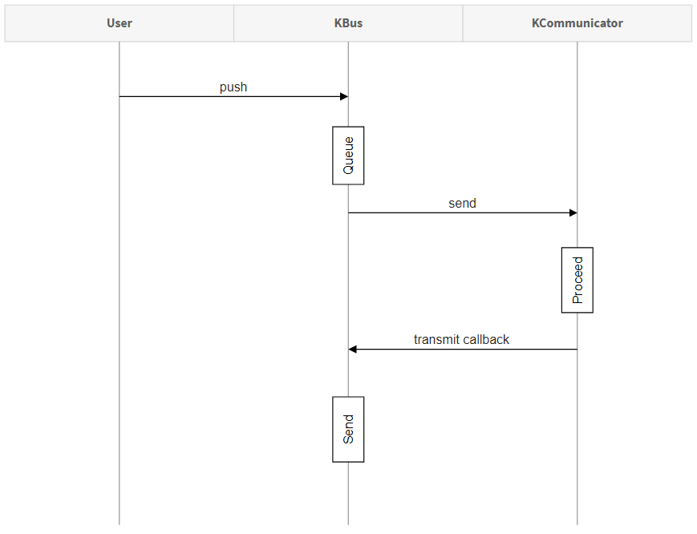
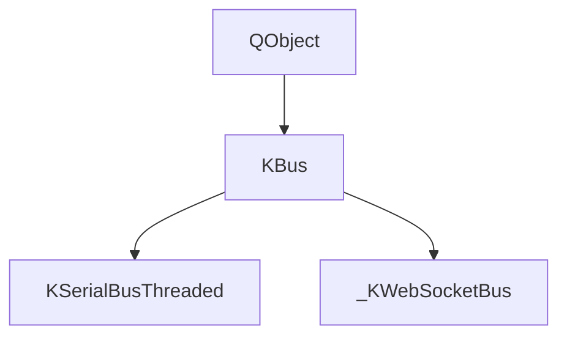
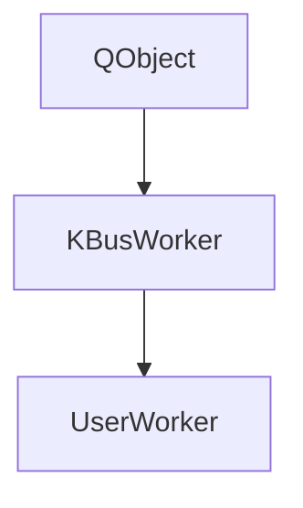
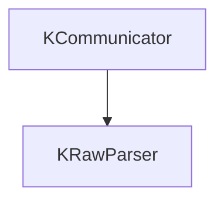

# Initialization
##### Add headers
```c
#include "kbusfactory.h"
#include "MyWorker.h"
```

##### Add declaration
```c
KBus *serial;
MyWorker myWorker;
```

##### Add initialization
```c
serial = KBusFactory::instance()->create("threaded", QVariantMap{{"port-name", "COM6"}, {"baud-rate", 9600}});
serial->start();
myWorker.setID(0x01);
serial->addWorker(&myWorker);
```

##### Add to application destructor
```c
delete serial;
```

<br/>

# Internal mechanism
### Workers
Your BusWorkers must inherited of BusWorker (`kbusworker.h`):
```c
class KBUS_EXPORT BusWorker
{
protected:
    uint8_t id;

public:
    BusWorker() {}
    virtual ~BusWorker() {}

    void setID(uint8_t id) { this->id = id; }
    virtual bool proceedPacket(const QByteArray &ar, int msec) = 0;
    virtual QList<QByteArray> getPacketsForSend(int msec) = 0;
};
```



#### Worker receive
When KBus read data from the target port it pushes data into KCommunicator. If KCommunicator solve the data is ready it calls receiveCallback.
In this callback KBus calls every worker and search the data owner. <br/>

#### Workers send
The KBus calls workers as soon as possible. If a worker has data to send it adds to a circular buffer to send later.


### User send
If a user want to send some data via KBus he must call KBus::push function, which adds data to the circular buffer and sends this data later.


<br/>

# Hierarchy


