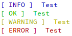
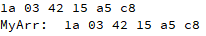

# How to use
```c
#include "vdebug.h"
```
#### Display message
```c
VDebug::Info("Test");
VDebug::Success("Test");
VDebug::Warning("Test");
VDebug::Error("Test");
```


#### Display array
```c
VDebug::Hex(arr);
VDebug::Hex("MyArr: ", arr);
```
